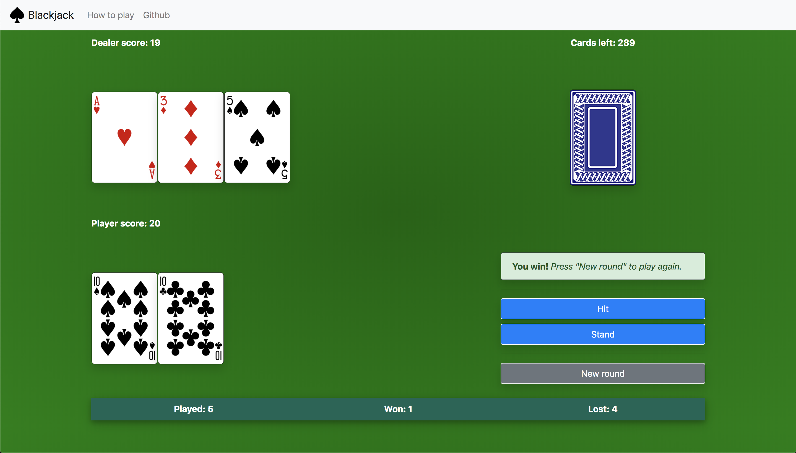

# Blackjack-js

*A simple blackjack game without betting using only HTML/CSS/JS & jQuery*

[Live version](https://felixweinberger.com/blackjack-js/) currently running on GitHub Pages.



## How to play

### Basics

1. This version of Blackjack is played with 6 decks and does not permit betting
1. Aces count as 1 or 11 points (whichever is better), 2-9 count according to their value and 10s and face cards each count 10 points
1. Each hand is valued as the sum of individual cards with the exception of a Blackjack (an ace and any 10-point card)
    + An ace and any 10-point card is ranked higher than any other hands achieving 21 points
1. The objective of the game is to win as many rounds as possible by beating the dealer
1. A round is won by having a total hand value close or at 21 without exceeding 21 __and__ beating the dealer's hand value

### How a round is played

1. Start a new round by pressing 'New round'
1. The dealer reveals one card for himself and 2 for your hand
1. You can choose one of two options:
    + Hit: the dealer deals you an additional card to your hand, increasing your hand value. You may hit until you either choose to stand or exceed 21 in hand value, in which case you lose.
    + Stand: you are no longer dealt additional cards and the dealer draws cards until he has at least 17 points or exceeds 21
1. Once all the cards are dealt, the hand values are scored and the winner is determined
1. You win if:
    + Your hand value does not exceed 21 _and_ your dealer's hand value exceeds 21
    + Your hand value does not exceed 21 _and_ your hand value is higher than the dealer's

## Running/developing the game locally

The easiest way to run the game locally is to use the NPM package `http-server`:

```sh
# Clone the code
cd ~/projects
git clone https://github.com/felixweinberger/blackjack-js
cd blackjack-js

# Install http-server
npm install -g http-server

# Run the server with caching disabled (for easier development)
http-server -c-1
```

When the server is up and running, point your browser to `localhost:8080` to play the game.
